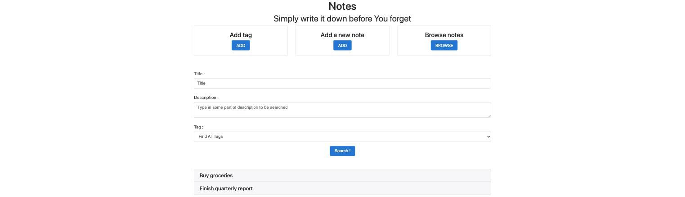

# springboot-quick-notes

[](https://github.com/hendisantika/springboot-quick-notes/actions/workflows/maven.yml)

A small Spring Boot + Thymeleaf web app for jotting down quick notes and organizing them with tags, backed by MongoDB.

## Screenshots

| Home | Add note |
| --- | --- |
|  |  |

| Add tag | Find notes |
| --- | --- |
|  |  |

## Features

- Create tags
- Create notes and attach one or more tags to them
- Search notes by title, description, and/or tag
- Delete notes

## Tech stack

- Java 25
- Spring Boot 4.1.x (Web, Validation, Thymeleaf, Data MongoDB)
- MongoDB
- Lombok
- Maven

## Prerequisites

- JDK 25+
- MongoDB running locally on `localhost:27017` (or update `src/main/resources/application.properties`)

The quickest way to get MongoDB running locally is with Docker:

```bash
docker run -d --name quick-notes-mongo -p 27017:27017 mongo:7
```

## Running the app

```bash
./mvnw spring-boot:run
```

The app starts on [http://localhost:8080](http://localhost:8080).

- `/home` — home page
- `/tag/add` — create a tag
- `/note/add` — create a note
- `/note/find` — search notes

## Running the tests

```bash
./mvnw test
```

The test suite boots the full Spring context, so a reachable MongoDB instance is required (see Prerequisites).

## Building a jar

```bash
./mvnw package
java -jar target/springboot-quick-notes-0.0.1-SNAPSHOT.jar
```

## Continuous Integration

Every push and pull request to `main` is built and tested via GitHub Actions (`.github/workflows/maven.yml`), which spins up a MongoDB service container so the test suite can run against a real database.
